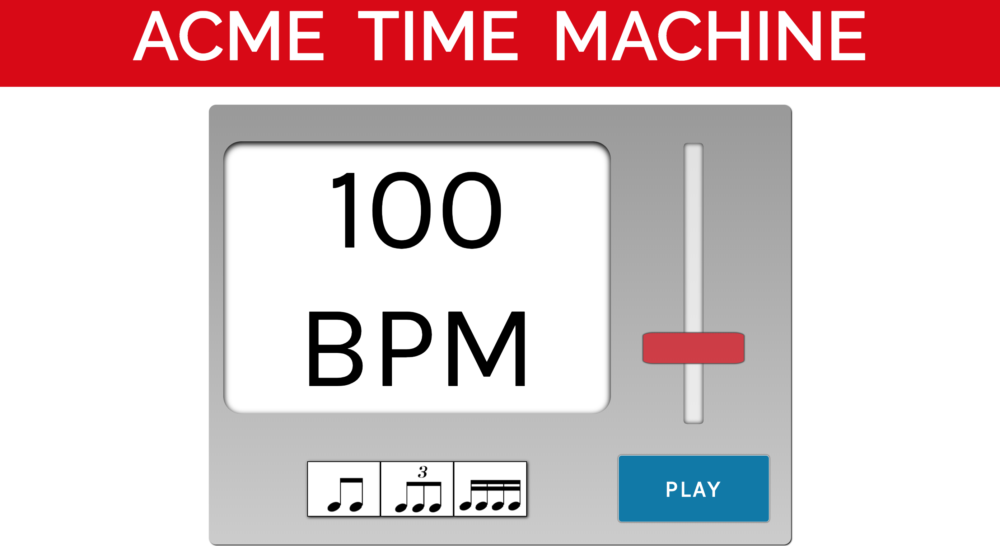
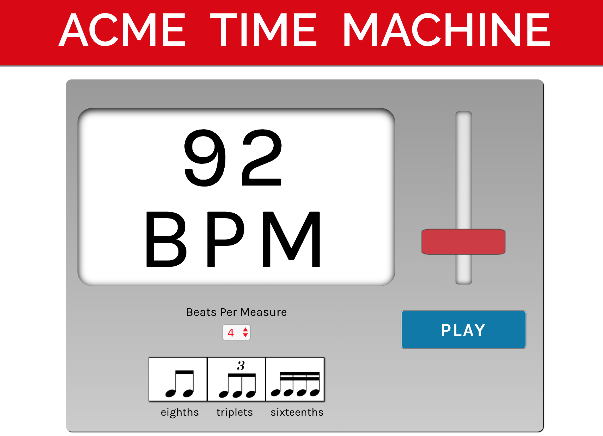

# Metronome Project
Title: Acme Time Machine

Created on Oct. 1, 2018 by Steve Hanlon

**Objective**: Create a metronome using ReactJS.  Display Beats Per Minute (BPM), a slider to control BPM and a start/stop button.  Use State to keep track of count, beatsPerMeasure, audio play state, and BPM. Add distinct audio click sounds for the first beat and following beats.

Additional Features:
- Add subdivision buttons to control whether metronome click plays back quarter, eighth, sixteenth or triplets subdivisions. Add distinct audio click sound for subdivisions.

- Add Time Signature selector to control beatsPerMeasure state.

Tools:
- ReactJS
- JavaScript 6
- CSS Grid
- CSS Flex box

Resources:
- Dave Ceddia's [project blog](https://daveceddia.com/react-practice-projects/)
