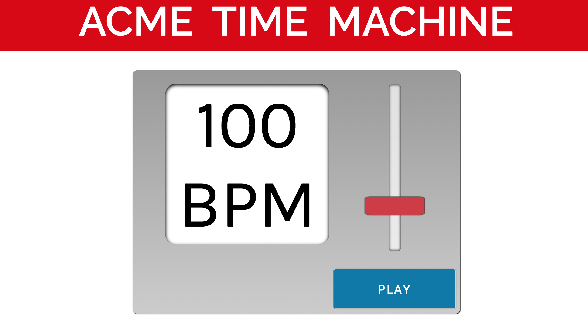

# Build a Metronome Project
from Dave Ceddia's [project blog](https://daveceddia.com/react-practice-projects/)

Created on Oct. 1, 2018 by Steve Hanlon

**Objective**: Create a metronome using ReactJS.  Show BPM, slider to control BPM and a start/stop button.  Use State to keep track of count, beatsPerMeasure, audio play state, and BPM.

Additional Future Features:
- Add subdivision buttons to control whether metronome click plays back quarter, eighth, sixteenth or triplets subdivisions.
- Add Time Signature selector to control beatsPerMeasure state
